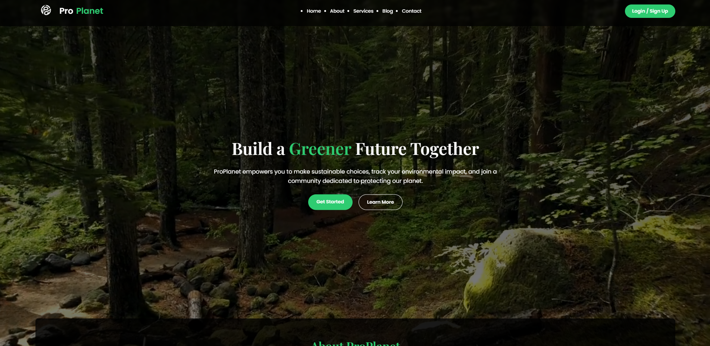
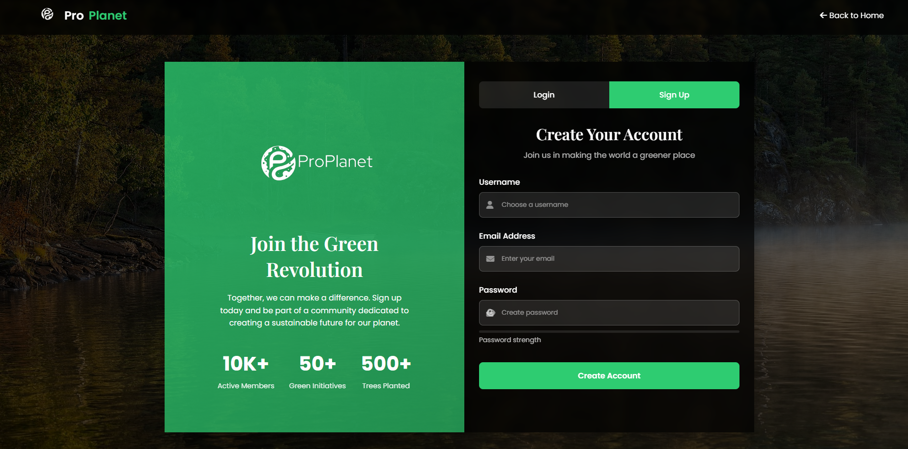
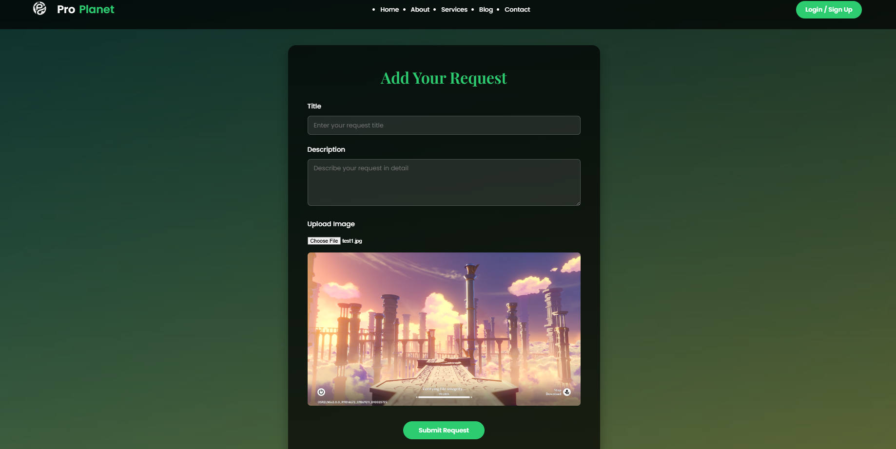
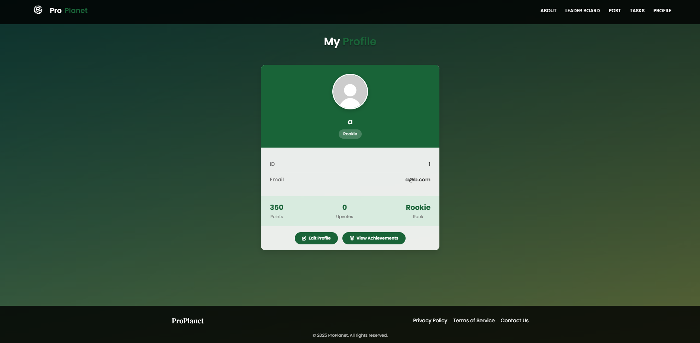
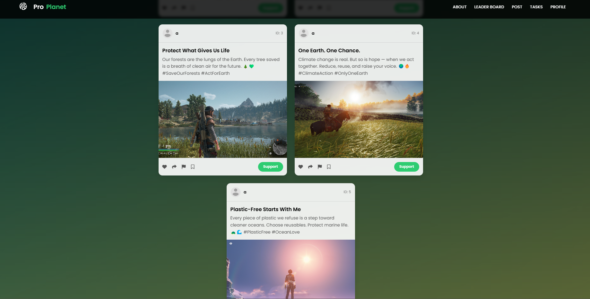
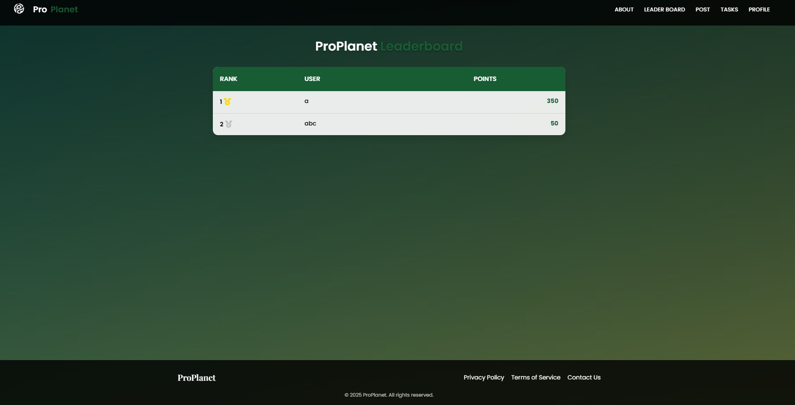

# Pro Planet

Pro Planet is a project aimed at promoting sustainable practices and environmental awareness through technology.

## Features
- **Eco-friendly Tips**: Learn how to reduce your carbon footprint.
- **Sustainability Tracker**: Track your progress in adopting green habits.
- **Community Support**: Connect with like-minded individuals.

## Installation
1. Clone the repository:
    ```bash
    git clone https://github.com/your-username/pro-planet.git
    ```
2. Navigate to the project directory:
    ```bash
    cd pro-planet
    ```
3. Set up a Python virtual environment:
    ```bash
    python -m venv env
    source env/bin/activate  # On Windows use `env\Scripts\activate`
    ```

4. Install dependencies:
    ```bash
    pip install -r requirements.txt
    ```

## Usage
After you setup the dockerfile db

Run the application locally:
```bash
python app.py
```

## Project Structure
```
pro-planet/
├── assets/         # Images and media files
├── app.py            # Source code
├── README.md       # Project documentation
└── ...   
```

## Screenshots
### Home Page







## License
This project is licensed under the MIT License. See the [LICENSE](LICENSE) file for details.

